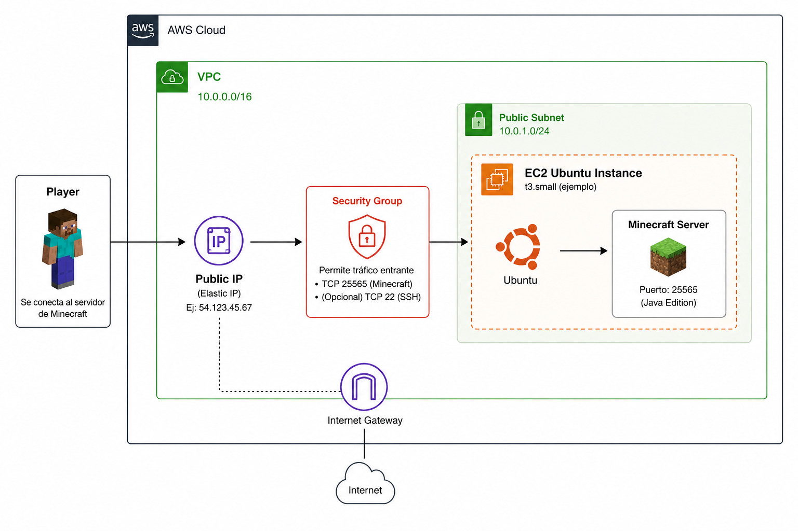
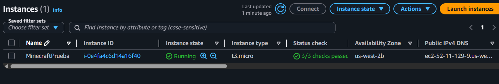
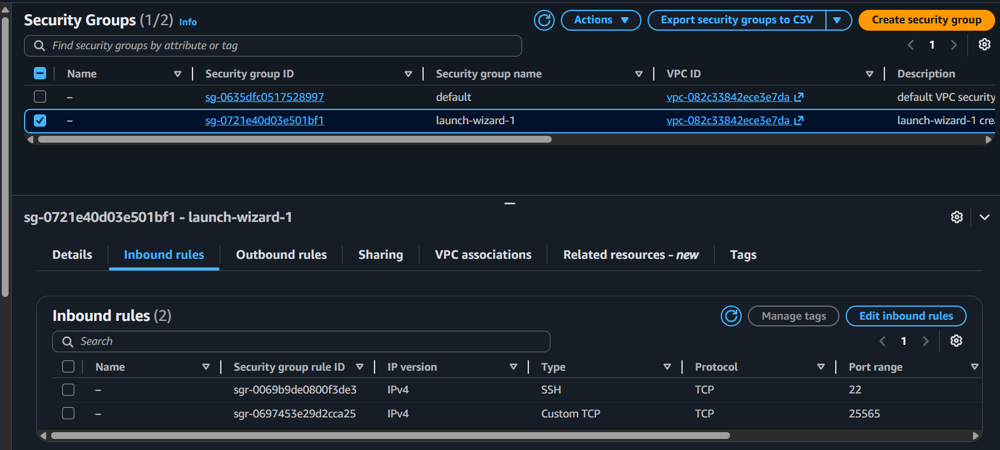
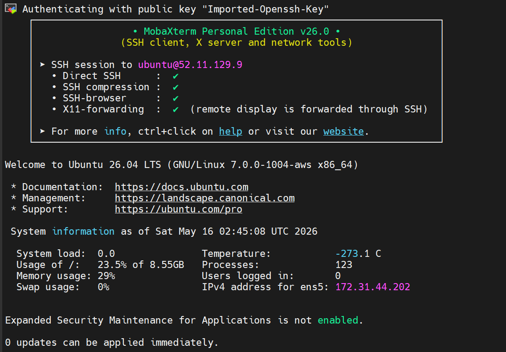
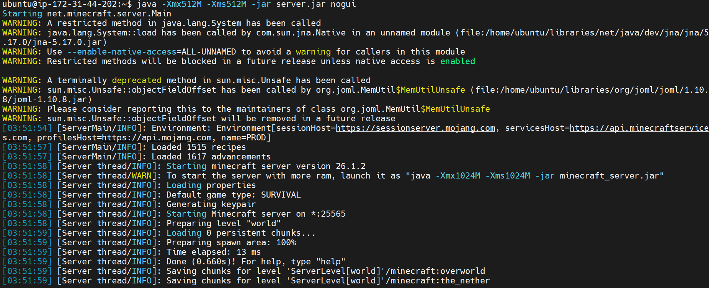
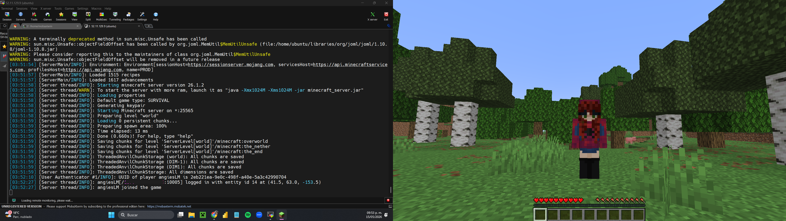

# CloudCraft - Minecraft Server on AWS EC2

## Overview

CloudCraft is a cloud-hosted Minecraft multiplayer server deployed on AWS EC2 using Ubuntu Linux and Java.

This project demonstrates practical cloud infrastructure skills including:

- AWS EC2 deployment
- Linux server administration
- Networking configuration
- Security Groups management
- SSH remote access
- Java runtime configuration
- Minecraft server deployment
- Troubleshooting and optimization

---

## Architecture

Player → Public IP → Security Group → EC2 Ubuntu Instance → Minecraft Server

## Architecture Diagram



---

## Technologies Used

- AWS EC2
- Ubuntu Server 22.04
- Java OpenJDK
- Linux CLI
- Bash
- GitHub

---

## Features

- Multiplayer Minecraft server hosted in the cloud
- Secure remote SSH access
- Configured Security Groups for Minecraft traffic
- Optimized memory allocation for AWS Free Tier instances
- Lightweight deployment for small multiplayer sessions

---

## Setup Process

### 1. Launch EC2 Instance

- Ubuntu Server 22.04
- t2.micro / t3.micro
- Configure Security Group:
  - Port 22 (SSH)
  - Port 25565 (Minecraft)

---

### 2. Connect via SSH

```bash
ssh -i your-key.pem ubuntu@YOUR_PUBLIC_IP
```

### 3. Install Java

```bash
sudo apt update
sudo apt install openjdk-21-jre-headless -y
```

### 4. Download Minecraft Server

```bash
wget YOUR_SERVER_URL -O server.jar
```

### 5. Accept EULA

```bash
nano eula.txt
```

Change:

```txt
eula=false
```

To:

```txt
eula=true
```

### 6. Run the Server

```bash
java -Xmx512M -Xms512M -jar server.jar nogui
```

---

## Challenges & Troubleshooting

### Memory Allocation Error

Issue:

```txt
Native memory allocation failed
```

Solution:
Reduced JVM heap size to 512MB for compatibility with AWS Free Tier instances.

---

### Java Version Compatibility Error

Issue:

```txt
UnsupportedClassVersionError
```

Solution:
Installed a compatible Java runtime version for the Minecraft server build.

---
## Screenshots

### EC2 Instance



### Security Group Configuration



### Minecraft Server Running



### Multiplayer Connection



## Future Improvements

- Docker containerization
- Terraform infrastructure deployment
- Automated backups with S3
- CloudWatch monitoring
- Route 53 domain configuration
- CI/CD automation

---

## Skills Demonstrated

- Cloud Infrastructure
- AWS EC2
- Linux Administration
- Networking
- SSH
- Troubleshooting
- Server Deployment
- Bash Scripting

---

## Author

Anyelina Irene Vilchis Sierra
